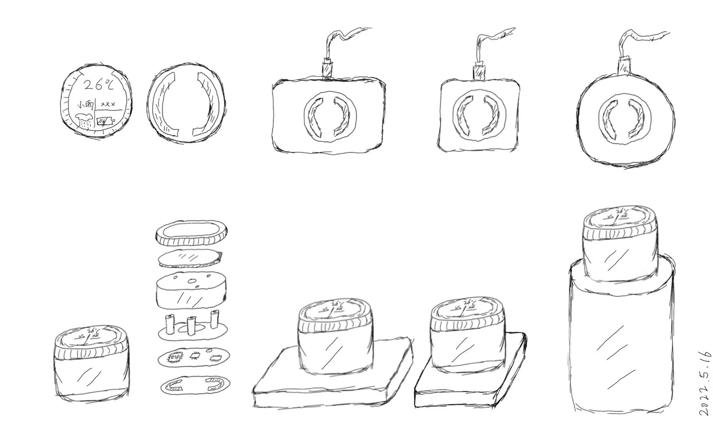
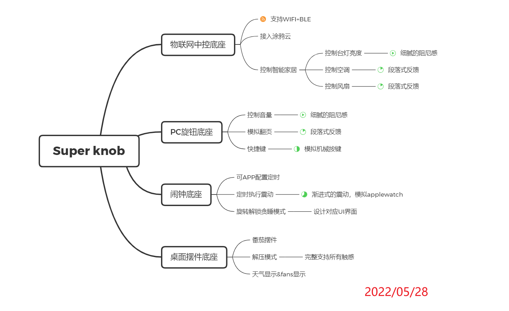
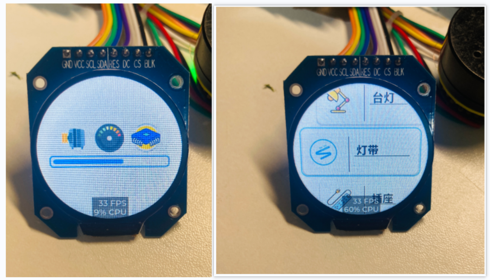

# Super knob

## 介绍
Super knob 是基于ESP32与无刷电机实现的超级旋钮，该项目基于国外开源项目：[smartknob](https://github.com/scottbez1/smartknob)

我将无刷电机的旋钮部分解耦出来，通过磁吸的方式搭配不同的底座，来实现各种应用场景，同时设计了一套协议用于旋钮与底座的交互，可实现针对不同场景带来不同的触感体验，甚至可以在同一个场景的不同操作下模拟不同的触感和阻尼反馈。类似于智能手机中线性马达对于不同应用或页面的机械触感模拟。

同时磁吸的灵感来源于大疆的Action2 方块相机，啪，即可将旋钮与不同外设进行磁吸配对，待开发稳定后，计划用CNC加工金属的外壳，来配合磁吸达到最舒服的体验。

例如：当同一个旋钮组件，磁吸到物联网中控的底座上面，自动弹出对应的UI界面，同时可以控制智能家具，且在控制台灯亮度和空调温度的时候，会带来不同的旋钮触感反馈。

例如：当同一个旋钮组件，磁吸到PC旋钮底座上面，即可变身为PC的超级旋钮，可以用他做翻页、快捷键、切换应用、调节音量和亮度，只要你喜欢，都可以分别为这几个功能配置不同的阻尼反馈。

将旋钮部分解耦开来，搭配不同的底座，即可实现控制万物，且触感与阻尼感各不相同，这是普通的机械旋钮不能带来的！

## 设计草图

## 功能架构

## UI界面演示

